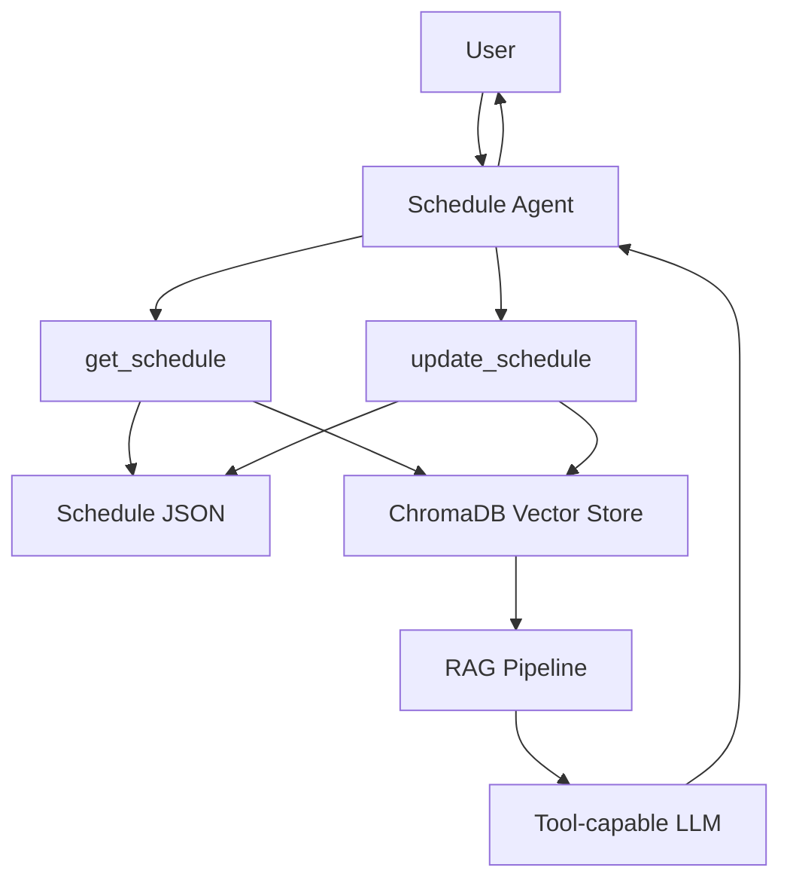

# Agentic RAG Schedule Assistant

An AI-powered schedule assistant for managing events across the next 30 days. It stores validated schedule data in JSON, mirrors event documents into ChromaDB, retrieves relevant context for schedule questions, and exposes an agent with exactly two tools:

- `get_schedule`
- `update_schedule`

The app supports natural-language queries like "What do I have tomorrow?", "Am I free Friday afternoon?", and "Add a meeting tomorrow at 4 PM called Client Discussion."

## Architecture



## Project Structure

```text
schedule-assistant/
|-- data/
|   `-- schedule.json
|-- chroma_db/
|-- src/
|   |-- __init__.py
|   |-- agent.py
|   |-- config.py
|   |-- data_manager.py
|   |-- date_utils.py
|   |-- main.py
|   |-- models.py
|   |-- rag.py
|   |-- tools.py
|   `-- vector_store.py
|-- tests/
|   `-- test_schedule.py
|-- .env.example
|-- .gitignore
|-- README.md
`-- requirements.txt
```

## Installation

```bash
python -m venv .venv
.venv\Scripts\activate
python -m pip install -r requirements.txt
```

The code has an offline deterministic embedding fallback for development and tests, but installing `sentence-transformers` gives better semantic retrieval.

## Environment Setup

Copy `.env.example` to `.env` and add your LLM key:

```text
OPENAI_API_KEY=your_key_here
OPENAI_MODEL=gpt-4.1-mini
```

If `OPENAI_API_KEY` is missing, the CLI still works with a deterministic local router. With the key present, the agent uses LangChain's current message/tool APIs and OpenAI tool calling.

## How ChromaDB Works

Each `ScheduleEntry` is converted into a readable document containing title, date, time, type, location, description, and status. ChromaDB stores the document, embedding, and metadata:

- `event_id`
- `date`
- `start_time`
- `end_time`
- `event_type`
- `status`

The vector database persists in `./chroma_db`. On startup, the app creates sample data only when no schedule exists, then synchronizes ChromaDB with the current JSON schedule. Updates replace the vector document, and removals delete it.

## How RAG Works

The RAG pipeline accepts a query, retrieves matching documents from ChromaDB, builds schedule context, and passes that context to the LLM when one is configured. It returns both:

- `answer`
- `source_documents`

No deprecated `RetrievalQA` chain is used.

## How The Agent Works

The agent follows a strict system prompt:

- Never invent events.
- Use `get_schedule` for schedule lookups and availability.
- Use `update_schedule` for add, update, and remove actions.
- Retrieve an event first when an update or removal needs an unknown ID.
- Do not silently overwrite or delete events.

Conflict detection happens inside `update_schedule` before adding or moving an event. If a time overlaps with another scheduled event, the assistant returns the conflict and asks whether to choose another time or schedule anyway.

## Tool Descriptions

### `get_schedule`

Retrieves schedule information from natural language, date/time filters, event types, and semantic vector search.

Examples:

- `What do I have tomorrow?`
- `What meetings do I have next week?`
- `Am I free Friday afternoon?`
- `Show my schedule on August 15.`

### `update_schedule`

Accepts structured parameters and supports:

- `add`
- `update`
- `remove`

Example:

```python
update_schedule(
    action="add",
    title="Project Review",
    date="2026-08-15",
    start_time="15:00",
    end_time="16:00",
    event_type="meeting",
    description="Review project progress",
)
```

## Run The Application

```bash
python -m src.main
```

You can also run:

```bash
python src/main.py
```

## Example Conversation

```text
You: What do I have scheduled tomorrow?
Assistant: Found 1 scheduled event:
Schedule for Saturday, August 15, 2026:
2:00 PM - 3:00 PM
Project Team Meeting
...

You: Am I free tomorrow afternoon?
Assistant: You are partially free ...

You: Add a meeting tomorrow at 4 PM called Client Discussion.
Assistant: Added "Client Discussion" ...
```

## Tests

```bash
python -m pytest
```

The tests cover adding, updating, removing, date retrieval, event-type retrieval, conflict detection, availability, ChromaDB synchronization, and example natural-language queries.

## Troubleshooting

- Missing API key: create `.env` from `.env.example`. The app still runs locally without an API key.
- ChromaDB errors: delete `chroma_db/` and run the app again to rebuild from `data/schedule.json`.
- Invalid dates or times: use ISO dates like `2026-08-15` and 24-hour times like `15:00` for structured calls.
- Empty schedule: remove `data/schedule.json` and restart to regenerate sample entries.

